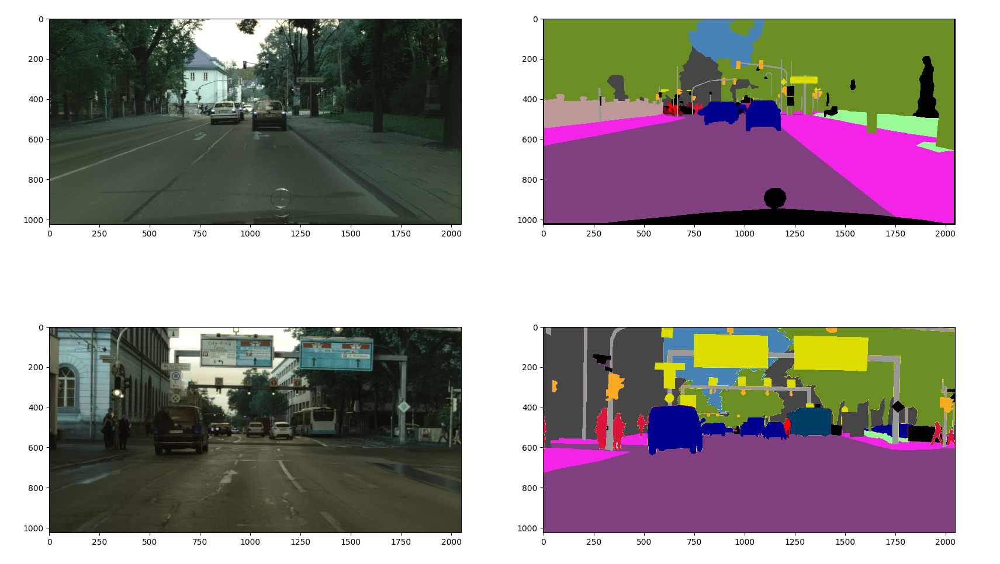
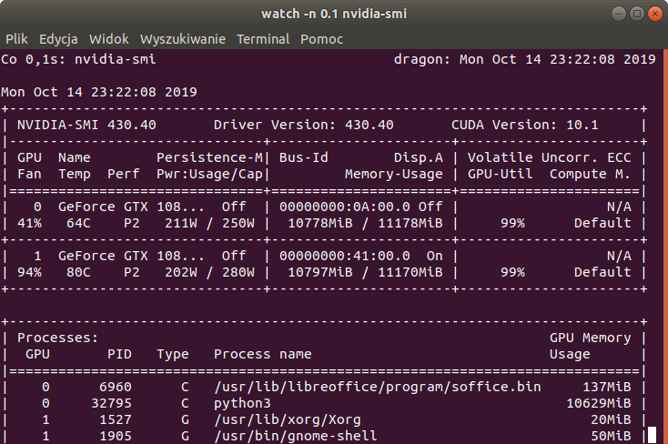
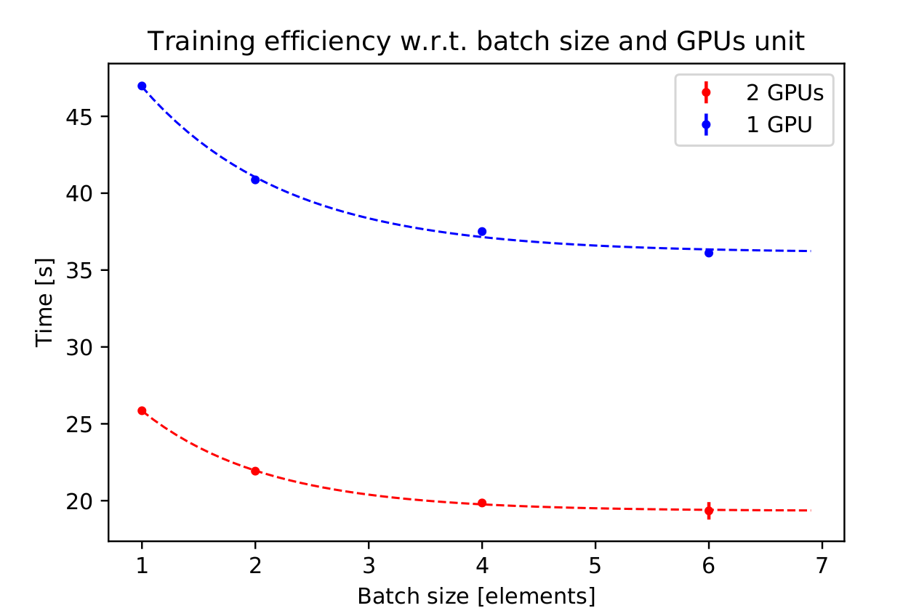
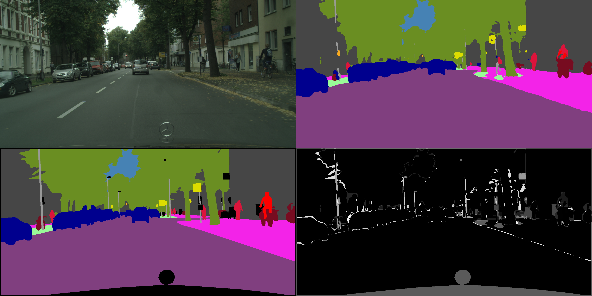
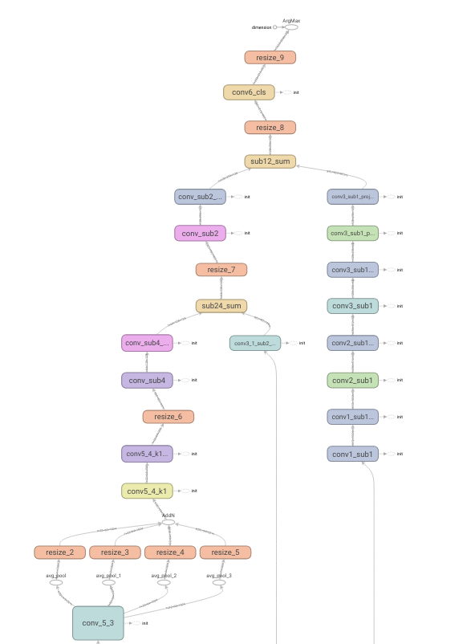
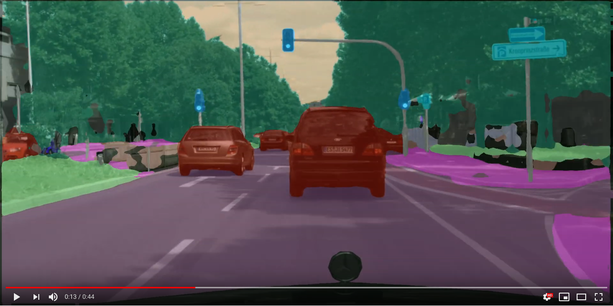
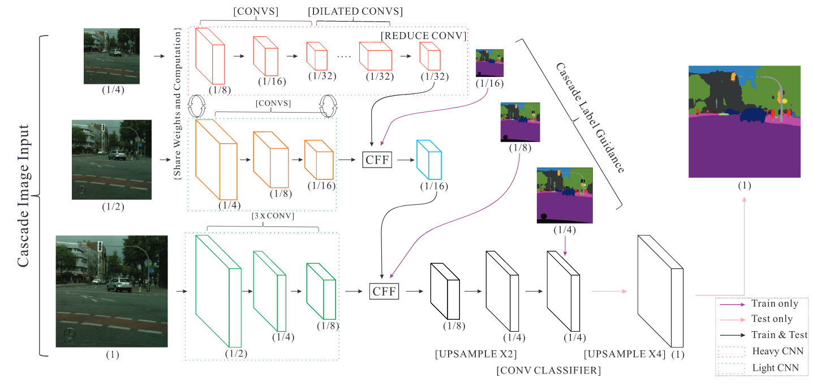

# Semantic Segmentation toolkit

## Project overview
The __TensorFlow Training Platform__ is a software toolkit to aid experiments 
connected with Deep Learning semantic segmentation. It was designed to boost
experiments pace and offload the end-user from creating _boilerplate_ code that
usually need to be developed in such case. As the name says, the platform is 
based on TensorFlow framework (1.13.0 as the project was started before tf 2.0
stable version was released).

## Installation
The toolkit is adjusted to be used in GPU set-up with efficient multi-GPU 
support. The GPU driver, __CUDA 10__ and __cuDNN__ need to be installed properly
as prerequisites. We advise to build TensorFlow from sources.

To install required dependencies:
```bash
pip install -r requirements.txt
```


## Usage

### Dataset conversion into *.tfrecords
Dataset conversion is based on *.yml configuration file. The default one is 
placed in [src/dataset/config/config.yml](src/dataset/config/config.yml). Its
structure is the following:

```yaml
dataset_dir: '/home/user/Dokumenty/CityScapes'
gt_dir: 'gtCoarse'
examples_dir: 'leftImg8bit'
output_tfrecords_dir: 'tfrecords'
mapping_file: 'mappings.yaml'
destination_size: [2048, 1024]
binary_batch_size: 100
tfrecords_base_name: 'city-scapes.tfrecords'
max_workers: 24
```
The util requires the dataset to be in a CityScapes format (with ground truth 
maps generated as images). In order to convert __your custom dataset__ please 
provide the data in appropriate format.

In order to run conversion type the following command:
```bash
python -m -m src.dataset.TfrecordsGenerator generate [--config_path custom_config.yml]
```

### Training
The toolkit was prepared to handle two types of training:
* w.r.t semantic segmentation objective
* w.r.t auto-encoding objective (implemented as an experiment pointed to verify 
 if AE pre-training may be useful in case of semantic segmentation).

Both types of training rely on the same configuration file - 
[src/train_eval/config/train-config.yml](src/train_eval/config/train-config.yml)
with the following structure:

```yaml
mode: 'train'
task: 'segmentation' # 'segmentation' / 'auto-encoding'

# IN CASE OF SEGMENTATION TRAINING USE *.tfrecords
dataset_dir: '/home/ppeczek/Dokumenty/CityScapes'
tfrecords_dir: 'tfrecords-new-pipeline'

# IN CASE OF AE TRAINING USE *.csv with list of file paths to be used
training_examples_list: '/home/ppeczek/Dokumenty/CityScapes/train_list.csv'
validation_examples_list: '/home/ppeczek/Dokumenty/CityScapes/val_list.csv'

mapping_file: 'mappings.yaml'
destination_size: [2048, 1024]
img_mean: [103.939, 116.779, 123.68]
tfrecords_base_name: 'city-scapes.tfrecords'
optimizer_options:
  optimizer_name: 'AdamW'
  learning_rate: 0.001
  weight_decay: 0.0001
model_name: 'ICNet'
num_classes: 20
ignore_labels: [0]
model_config:
  lambda_1: 0.16
  lambda_2: 0.4
  lambda_3: 1.0

checkpoint_to_restore: 'optional_pre_trained_weights'
model_storage_directory: '/archive/model_storage/big_images_model/'
checkpoint_name: 'checkpoint'
batch_size: 6
gpu_to_use: [0, 1]
#gpu_to_use: 0 # Some features (e.g. model input visualisation) do only work on single GPU
epochs: 10000
increase_saving_frequency_loss_treshold: 0.15 # After this level the checkpoint saving frequency will be doubled.
saving_frequency: 5
measure_train_accuracy: False
measure_train_accuracy_frequency: 5
measure_val_accuracy: True
measure_val_accuracy_frequency: 1
dummy_iterator_tfrecords_files: 100
dummy_iterator_examples: 100
radnom_data_transformation: True
transoformation_options:
  application_probability: 0.2
  transformation_chain: [
    'adjust_contrast', 'adjust_brightness', 'gaussian_noise', 'horizontal_flip', 'crop_and_scale', 'rotation'
  ]
  adjust_contrast_probability: 0.1
  adjust_brightness_probability: 0.1
  gaussian_noise_probability: 0.1
  horizontal_flip_probability: 0.1
  crop_and_scale_probability: 0.1
  rotation_probability: 0.1
```

Mapping file should be placed in __dataset_dir__ and has the following structure:
```yaml
road: [1, [128, 64, 128]]
sidewalk: [2, [244, 35,232]]
building: [3, [70, 70, 70]]
[...]
class_name: [class_id, [class_color]]
```

The training output will be placed in __model_storage_directory__. Apart from
model checkpoints, loss log will be preserved as well as configuration used to 
train a model.

To run training:
```bash
python -m src.train_eval.TrainingSupervisor.py full_training DESCRIPTIVE_NAME [--config-path CONFIG_PATH]
```

Another __TrainingSupervisor__ modes:

To run overfit training (small fraction of training dataset will be used to
train the model to verify its convergence):
```bash
python -m src.train_eval.TrainingSupervisor.py overfit_training DESCRIPTIVE_NAME [--config-path CONFIG_PATH]
```

To visualise model input:
```bash
python -m src.train_eval.TrainingSupervisor.py visualise_data_augmentation DESCRIPTIVE_NAME [--config-path CONFIG_PATH]
```

The output of visualisation is the following:



The util may be useful to validate random data augmentation (see 
section __Random data augmentation__)

#### Performance note
The toolkit was designed to utilize GPU resources to the full and make extensive 
use of multi-GPU set up thanks to data palatalization technique:





### Model evaluation

The evaluation is based on yet another config file 
[src/train_eval/config/val-config.yml](src/train_eval/config/val-config.yml):
```yaml
mode: 'val'
task: 'segmentation' # 'auto-encoding' - AE only works for getting inference results

# IN CASE OF SEGMENTATION TRAINING USE *.tfrecords
dataset_dir: '/home/ppeczek/Dokumenty/CityScapes'
tfrecords_dir: 'tfrecords-new-pipeline'
tfrecords_base_name: 'city-scapes.tfrecords'
mapping_file: 'mappings.yaml'
num_classes: 20

# IN CASE OF AE TRAINING USE *.csv with list of file paths to be used
validation_examples_list: '/home/ppeczek/Dokumenty/CityScapes/val_list.csv'
validation_samples_mapping: '/home/ppeczek/Dokumenty/CityScapes/tfrecords-new-pipeline/val_samples_mapping.csv'

img_mean: [103.939, 116.779, 123.68]
destination_size: [2048, 1024]
model_name: 'ICNet'
ignore_labels: [0]
model_dir: '/archive/model_storage/big_images_model/plain_icnet_augmented_1_2019_10_21_22:06'
checkpoint_name: 'checkpoint.ckpt-95'
batch_size: 8
gpu_to_use: 0
```

In order to evaluate model, first you need to get the inference results:
```bash
python -m src.train_eval.EvaluationSupervisor get_predictions_from_model [--config-path CONFIG_PATH]     
```

Results will be persisted in __model_inference__ subdirectory of __model_dir__.
In case of semantic segmentation model you may expect results in the following 
format:

To clearly visualise differences between ground-truths and predictions, 
as well as:

to make it possible to measure inference accuracy metrics. Point that the 
inference results are numbered accordingly with *.csv files generated while 
dataset into *.tfrecords conversion.

Having inference results persisted you can evaluate inference:
```bash
python -m src.train_eval.EvaluationSupervisor evaluate_inference [--config-path CONFIG_PATH]     
```

Evaluation output will be the following:
```bash
100%|██████████████████████████████████████████████████████████| 500/500 [03:20<00:00,  2.48it/s]
Class 1: 0.7743093514948698
Class 2: 0.6373916358846434
Class 3: 0.8021708650614886
Class 4: 0.28840329670608555
Class 5: 0.3658983557015586
Class 6: 0.34051278180715994
Class 7: 0.39610028240287865
Class 8: 0.49071056426419035
Class 9: 0.8527620306923158
Class 10: 0.4641654457746364
Class 11: 0.8506713714829641
Class 12: 0.5405851087730772
Class 13: 0.2482304963916349
Class 14: 0.8481739187007196
Class 15: 0.5044760927423055
Class 16: 0.5308642153808043
Class 17: 0.3855635293878845
Class 18: 0.15296872199318876
Class 19: 0.5491289679287716
mIou: 0.5275308964511146
```

__Other EvaluationSupervisor modes:__

In order to profile inference speed:
```bash
python -m src.train_eval.EvaluationSupervisor measure_inference_speed
```


To visualise graph:
```bash
python -m src.train_eval.EvaluationSupervisor visualise_graph
```
As a result, the command to run TensorBoard will be generated, e.g.:
```bash
tensorboard --logdir=/archive/model_storage/big_images_model/plain_icnet_augmented_1_2019_10_21_22:06/graph_summary
```
Then you can investigate computational graph, e.g.:


## Video inference
You can also visualise the inference on video stream - 
[src/train_eval/config/inference-config.yml](src/train_eval/config/inference-config.yml)

```yaml
mapping_file: '/home/ppeczek/Dokumenty/CityScapes/mappings.yaml'
destination_size: [2048, 1024]
model_name: 'ICNet'
num_classes: 20
img_mean: [103.939, 116.779, 123.68]
model_dir: '/archive/model_storage/big_images_model/plain_icnet_augmented_1_2019_10_21_22:06'
checkpoint_name: 'checkpoint.ckpt-95'
gpu_to_use: 0
input_video: '/home/ppeczek/Dokumenty/CityScapes/video/converted_video/big_stuttgart_01.avi'
persist_video: True
output_video_file: '/home/ppeczek/Dokumenty/CityScapes/video/converted_video/infered_stuttgart_aug_icnetv4.avi'
```

In order to obtain video file from continuous frames (like in case of 
CityScapes) dataset:
```bash
python -m src.dataset.VideoGenerator.py generate --frames-dir-path FRAMES_DIR_PATH --outputh-path OUTPUTH_PATH [--width WIDTH] [--height HEIGHT]
```

To visualise inference on video:
```bash
python3 -m src.train_eval.InferenceTool infer_on_video_stream
```

The output (__point that colour mapping bug was fixed__):
[](https://www.youtube.com/watch?v=r55sNnIZVGo)


## Dataset analysis
A set of tools was created to aid initial dataset analysis process. The features 
are supposed to provide basic information about dataset structure.

The tool is parametrized via 
[src/dataset/config/analysis_config.yml](src/dataset/config/analysis_config.yml):

```yaml
images_path: '/home/ppeczek/Dokumenty/CityScapes/dataset_analysis/gt_val_list.txt'
target_size: [2048, 1024]
workers: 24
mapping_path: '/home/ppeczek/Dokumenty/CityScapes/mappings.yaml'
results_dir: '/home/ppeczek/Dokumenty/CityScapes/dataset_analysis'
analysis_config:
  to_be_used: [
    'class_occupation',
    'poly_line_complexity',
    'instances_analyzer',
    'receptive_field'
  ]
  configurable:
    receptive_field:
      analyzer: # __init__ kwargs passed to analyzer associated with receptive_field
        mapping_path: '/home/ppeczek/Dokumenty/CityScapes/mappings.yaml'
        kernel_size: [5, 5]
        stride: [2, 2]
``` 

The configuration is tightly coupled with 
[analyzers_register.py](src/dataset/analysis/analyzers_register.py):
```python
ANALYZERS = {
    'class_occupation': ClassOccupationAnalyzer,
    'poly_line_complexity': PolyLineComplexityAnalyzer,
    'instances_analyzer': InstancesAnalyzer,
    'receptive_field': ReceptiveFieldAnalyzer

}

CONSOLIDATORS = {
    'class_occupation': ClassAverageConsolidator,
    'poly_line_complexity': ClassAverageConsolidator,
    'instances_analyzer': ClassAverageConsolidator,
    'receptive_field': AverageConsolidator
}
```
This config file maps the Analyzers/Consolidators to be used as functional pairs
in case of particular analysis type. The reason for such structure is the following.
Dataset analysis divided into two phases: __parallel map__ and sequential reduce. 

In order to implement new analysis feature you should extend at least one of the 
following classes:

```python
class GroundTruthAnalyzer(ABC):

    @abstractmethod
    def analyze(self, ground_truth: PreprocessedGroundTruth) -> AnalysisResult:
        raise RuntimeError('This method must be implemented by derived class.')


class GroundTruthAnalysisConsolidator(ABC):

    @abstractmethod
    def consolidate(self,
                    already_consolidated: AnalysisResult,
                    to_consolidate: AnalysisResult) -> AnalysisResult:
        raise RuntimeError('This method must be implemented by derived class.')
```

and update [analyzers_register.py](src/dataset/analysis/analyzers_register.py) 
accordingly.

### Description of predefined analysis options:
* ClassOccupationAnalyzer - measures field occupied by a semantic class.
* PolyLineComplexityAnalyzer - measures number of vertices that are components of
a particular class objects.
* InstancesAnalyzer - measures number of instances of a given class.
* ReceptiveFieldAnalyzer - measures number of distinct classes that lay inside 
_receptive_field_ (operation similar to 2d convolution performed by Neural Network).
* ClassAverageConsolidator - averages per class.
* AverageConsolidator - averages per dataset example.

## Predefined models:
### ICNet
__Citation:__
```bibtex
@inproceedings{zhao2018icnet,
  title={ICNet for Real-Time Semantic Segmentation on High-Resolution Images},
  author={Zhao, Hengshuang and Qi, Xiaojuan and Shen, Xiaoyong and Shi, Jianping and Jia, Jiaya},
  booktitle={ECCV},
  year={2018}
}
```

__Model overview:__



### ICNetV12 
Custom ICNet model variation created while experiments.

### Model base class
In order to create custom model compatible with the platform you should extend 
the following class:
```python
class Network:

    class Block:

        @classmethod
        def output_registered(cls, node_name: str):

            def decorator(layer_fun):

                def register_wrapper(_self, *args, **kwargs):
                    out_node = layer_fun(_self, *args, **kwargs)
                    _self._register_output(
                        node=out_node,
                        node_name=node_name)
                    return out_node

                return register_wrapper

            return decorator

    MAIN_OUTPUT_NAME = 'out'
    _MISSING_NODE_ERROR_MSG = 'Node name(s) required as output not present.'

    def __init__(self,
                 output_classes: int,
                 image_mean: Optional[List[float]] = None,
                 ignore_labels: Optional[List[int]] = None,
                 config: Optional[dict] = None):
        self._output_classes = output_classes
        self._ignore_labels = ignore_labels
        self._output_nodes = {}
        self._config = config
        self._image_mean = None
        if image_mean is not None and len(image_mean) is 3:
            mean_tensor = tf.convert_to_tensor(
                image_mean,
                dtype=tf.float32)
            self._image_mean = tf.expand_dims(mean_tensor, axis=0)

    @abstractmethod
    def feed_forward(self,
                     x: tf.Tensor,
                     is_training: bool = True,
                     nodes_to_return: RequiredNodes = None) -> NetworkOutput:
        """
        This method should allow the caller to get feed-forward network
        result - with possibility to obtain any registered node which may be
        useful when using the model later on. In particular - this method
        should be invoked by training_pass() in order to get nodes
        required to compute training loss.
        """
        raise NotImplementedError('This method must be implemented in '
                                  'derived class.')

    @abstractmethod
    def training_pass(self, x: tf.Tensor, y: tf.Tensor) -> tf.Operation:
        """
        Method invoked while training, should return error operation in
        order to make it possible to train model with chosen optimizer.
        Should use feed_forward() method to obtain desired network output.
        """
        raise NotImplementedError('This method must be implemented in '
                                  'derived class.')

    @abstractmethod
    def infer(self, x: BlockOutput) -> NetworkOutput:
        """
        Method used while inference from trained model.
        """
        raise NotImplementedError('This method must be implemented in '
                                  'derived class.')

```

and __register the model name__ in 
[models_register.py](src/common/models_register.py):

```python
NAME_TO_MODEL = {
    'ICNet': ICNet,
    'ICNetAutoEncoder': ICNetAutoEncoder,
    'ICNetV12': ICNetV12
}
```

Please point that inner class __Block__ has a function decorator to register
model output. If you want to obtain more output while calling __feed_forward()__
(specified in __nodes_to_return__) you need to either explicitly use 
___register_output()__ or wrap a part of model in decorated function, e.g.:

```python
@Network.Block.output_registered('conv_sub4')
    def __small_images_branch(self,
                              conv3_1: tf.Tensor,
                              input_size: Size,
                              is_training: bool = True) -> tf.Tensor:
        conv3_1_sub4 = downsample_bilinear(
            x=conv3_1,
            shrink_factor=2)
        [...]
        return tf.layers.batch_normalization(
            inputs=conv_sub4,
            training=is_training,
            name='conv_sub4_bn')
```

What is more, several widely used layers:

```python
def downsample_conv2d(x: tf.Tensor,
                      num_filters: int,
                      kernel_size: Tuple[int, int],
                      strides: Tuple[int, int] = (2, 2),
                      activation: Optional[str] = 'relu',
                      name: Optional[str] = None,
                      padding: str = 'SAME',
                      **kwargs) -> tf.Tensor:
    """
    Convolution layer that reduce the spatial dimensions.
    """
    return tf.layers.conv2d(
        inputs=x,
        filters=num_filters,
        kernel_size=kernel_size,
        strides=strides,
        padding=padding,
        activation=activation,
        name=name,
        *kwargs)
```

and network building blocks:

```python
def pyramid_pooling(x: tf.Tensor,
                    pooling_config: PyramidPoolingConfig,
                    output_size: Size,
                    name: Optional[str] = None) -> tf.Tensor:
    pooling_heads = []
    for head_id, (window_shape, strides) in enumerate(pooling_config):
        pooling_head = _pyramid_pooling_head(
            x=x,
            window_shape=window_shape,
            strides=strides,
            output_size=output_size,
            name=name,
            head_id=head_id)
        pooling_heads.append(pooling_head)
    return _pyramid_pooling_fusion(inputs=pooling_heads, name=name)
```

were already embedded in platform (style is compliant with layers provided by 
TensorFlow - customizations are mainly just wrappers that are convenient to 
use in case of semantic segmentation).


## Random data augmentation
The toolkit supports dynamic data augmentation while training:


In order to expand the augmentation options you should extend the following class:

```python
class DatasetTransformation(ABC):

    def __init__(self, transformation_type: TransformationType):
        self._transformation_type = transformation_type

    @abstractmethod
    def apply(self,
              image: tf.Tensor,
              label: tf.Tensor,
              application_probab: float,
              parameters: Optional[dict]
              ) -> Tuple[tf.Tensor, tf.Tensor]:
        raise NotImplementedError('This method must be implemented')
```

and register the transformation in 
[DatasetTransformationFactory](src/dataset/training_features/transformations/DatasetTransformationFactory.py)

__TODO:__ registering new random transformations need to be refactorized and in 
a way that is used e.g. to register new models.

## Additional utils

### Network features (aka activations) visualisation
It is possible to visualise network activations as response to a particular input 
(feature map slices are normalized w.r.t a particular depth channel and blended 
with original image as value of RED channel in RGB color model). The tool is 
available to be used as a function - 
[usage example](src/notebooks/FeaturesVisualization.ipynb)

```python
# prepare input placeholder and output node
network = ICNetAutoEncoder(20, [103.939, 116.779, 123.68], [0], {'lambda_1': 0.16, 'lambda_2': 0.4, 'lambda_3': 1.0})
with tf.variable_scope(tf.get_variable_scope(), reuse=tf.AUTO_REUSE):
    # can be ommited if not re-using weight inside network
    x = tf.placeholder(tf.float32, [None, 1024, 2048, 3])
    y_operation = network.infer(x)

# define network nodes to visualise output
nodes_to_test = ['some_layer_name']


# useage of visualize_features()
with tf.Session() as sess:
    network.restore_checkpoint(model_path, sess)
    visualize_features(
        session=sess,
        graph=graph,
        nodes=nodes_to_test,
        input_images=images_to_test,
        x_placeholder=x,
        target_dir='target_dir'
    )
```

Result example:


### Operations profiling
It is also possible to profile (time-wise) particular operations/layers/network 
building blocks. The tool is also available as function - see 
[usage_example](src/notebooks/OperationsProfiling.ipynb).

```python
# prepare input placeholder and output node
network = ICNet(20, [103.939, 116.779, 123.68], [0], {'lambda_1': 0.16, 'lambda_2': 0.4, 'lambda_3': 1.0})
with tf.variable_scope(tf.get_variable_scope(), reuse=tf.AUTO_REUSE):
    # can be ommited if not re-using weight inside network
    x = tf.placeholder(tf.float32, [1, 1024, 2048, 3])
    y_operation = network.infer(x)
    
    
# tool usage
profiling_results = profile_operation(
    operation=y_operation,
    x_placeholder=x,
    device='/gpu:0'
)
```

## Tests
To run tests please use the following command:

```bash
pytest
```

## Additional citations
```bibtex
@inproceedings{Cordts2016Cityscapes,
title={The Cityscapes Dataset for Semantic Urban Scene Understanding},
author={Cordts, Marius and Omran, Mohamed and Ramos, Sebastian and Rehfeld, Timo and Enzweiler, Markus and Benenson, Rodrigo and Franke, Uwe and Roth, Stefan and Schiele, Bernt},
booktitle={Proc. of the IEEE Conference on Computer Vision and Pattern Recognition (CVPR)},
year={2016}
}
```